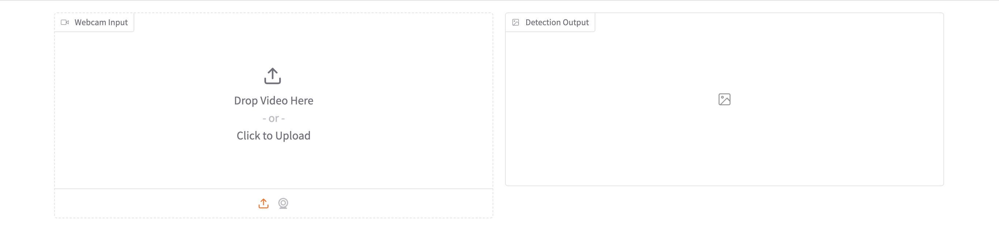
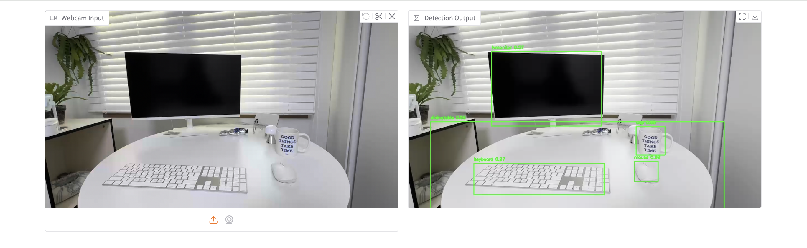

# Object Detection with Gradio

This project demonstrates how to use the YOLOv3 model for object detection, integrated with a Gradio interface for real-time webcam input. The application detects objects in video frames and displays them with bounding boxes and labels.

## Features
  
  
  
- **YOLOv3 Integration**: Uses the YOLOv3 model for accurate object detection.
- **Gradio Interface**: Provides an easy-to-use web interface to display detection results.
- **Real-Time Webcam Support**: Processes video input from a webcam and displays detection results live.

## Requirements

Before running the project, ensure you have the following installed:

- Python 3.8 or higher
- OpenCV (`cv2`)
- Gradio (`gradio`)
- Numpy (`numpy`)

You can install the dependencies with:

```bash
pip install -r requirements.txt
```

## File Structure

```bash
├── yolo3/
│   ├── yolov3.weights    # YOLOv3 pre-trained weights file
│   ├── yolov3.cfg        # YOLOv3 configuration file
│   ├── coco.names        # File containing class names
├── demo/
│   ├── demo_1.png
│   ├── demo_2.png    
├── yolo_object_detection_with_gradio.py  # Main script
├── requirements.txt  
├── README.md             # Project documentation

```

> **Note**: You need to download the YOLOv3 weights and configuration files from [Darknet YOLO](https://pjreddie.com/darknet/yolo/) and place them in the `yolo3/` folder.


## Usage
1.	Clone the repository:
  ```bash
  git clone https://github.com/seonokkim/object-detection-gradio.git
  cd object-detection-gradio
  ```
2. Ensure all dependencies are installed:
  ```bash
  pip install -r requirements.txt  
  ```
3.	Run the application:
  ```bash
  python yolo_object_detection_with_gradio.py
  ```
4.	Open the Gradio interface in your browser (it will provide a local or public link).


## Acknowledgments

- [YOLOv3](https://arxiv.org/pdf/1804.02767) - You Only Look Once, for real-time object detection.
- [Gradio](https://gradio.app/) - For creating a simple web interface for ML applications.

## License

This project is licensed under the MIT License. See the [LICENSE](LICENSE) file for details.
